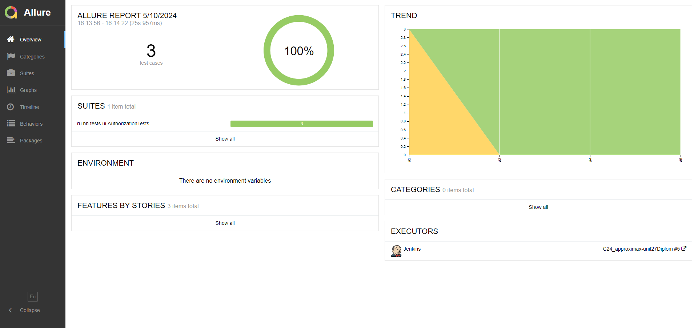
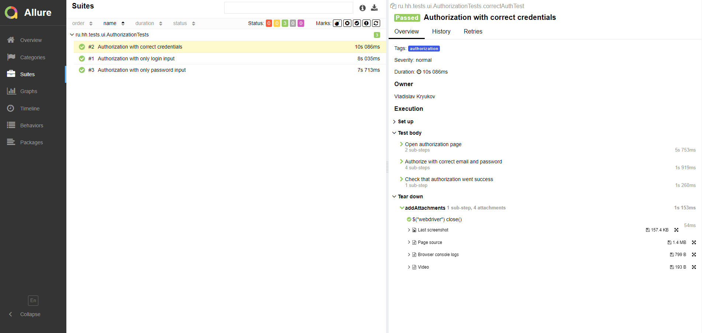
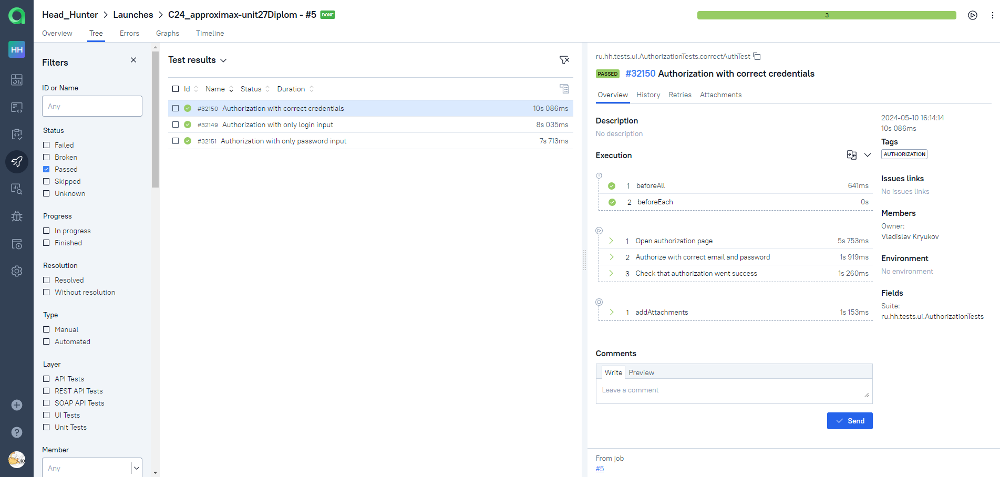
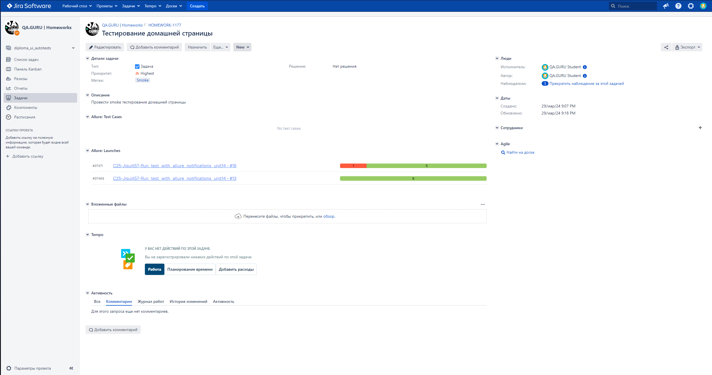

# Test UI automation project for [Head Hunter](https://hh.ru/)


## About Head Hunter
One of the largest job boards that helps people find job opportunities in Russia, Kazakhstan, and Belarus is HeadHunter. It has over 515 thousand companies as clients.

## Contents
- <a href="#technologies">Tools and technologies</a>
- <a href="#testcases">Executed automation test cases</a>
- <a href="#running">Running Autotests</a>
- <a href="#report">Allure Report</a>
- <a href="#testops">Allure TestOps integration</a>
- <a href="#jira">Jira integration</a>
- <a href="#telegram">Telegram notifications via bot</a>
- <a href="#video">Selenoid video of test run</a>

<a id="technologies"></a>
## Tools and technologies
  Java                                                                                                    | IntelliJ  <br>  Idea                                                                                               | GitHub                                                                                                     | JUnit 5                                                                                                           | Gradle                                                                                                     | Selenide                                                                                                         | Selenoid                                                                                                                  | Allure <br> Report                                                                                                         |  Jenkins                                                                                                        |   Jira                                                                                                              | Telegram                                                                                                            |Allure <br> TestOps                                                                                                                |Rest <br> Assured                                                    
|:---------------------------------------------------------------------------------------------------------|--------------------------------------------------------------------------------------------------------------------|------------------------------------------------------------------------------------------------------------|-------------------------------------------------------------------------------------------------------------------|------------------------------------------------------------------------------------------------------------|------------------------------------------------------------------------------------------------------------------|---------------------------------------------------------------------------------------------------------------------------|----------------------------------------------------------------------------------------------------------------------------|-----------------------------------------------------------------------------------------------------------------|---------------------------------------------------------------------------------------------------------------------|---------------------------------------------------------------------------------------------------------------------|-----------------------------------------------------------------------------------------------------------------------------------|--------------------------------------------------------------------------------------------------------------------:|
| <a href="https://www.java.com/"></a> | <a href="https://www.jetbrains.com/idea/"></a> | <a href="https://github.com/"></a> | <a href="https://junit.org/junit5/"></a> | <a href="https://gradle.org/"></a> | <a href="https://selenide.org/"></a> | <a href="https://aerokube.com/selenoid/"></a> | <a href="https://github.com/allure-framework"></a> |<a href="https://www.jenkins.io/"></a> | <a href="https://www.atlassian.com/software/jira/"></a> | <a href="https://web.telegram.org/"></a> |<a href="https://qameta.io/"></a> |<a href="https://rest-assured.io/"></a>  
- To create autotests in this project the <code>[Java](https://www.java.com/)</code> language was used.
- <code>[Gradle](https://gradle.org/)</code> was used as an automatic build system.
- Frameworks <code>[JUnit5](https://junit.org/junit5/)</code> and <code>[Selenide](https://selenide.org/)</code> for automated testing of web applications have been applied.
- Browsers were launched via <code>[Selenoid](https://aerokube.com/selenoid/)</code>.
- To run tests remotely a job was implemented in <code>[Jenkins](https://jenkins.autotests.cloud/job/MaryPimenova-VacancyProjectUnit14/)</code> with the creation of an <code>[Allure-report](https://jenkins.autotests.cloud/job/MaryPimenova-VacancyProjectUnit14/7/allure/)</code> and sending the results to <code>[Telegram](https://web.telegram.org/)</code> using special Telegram bot.
- Integrations with с <code>[Allure TestOps](https://allure.autotests.cloud/project/2434/dashboards)</code> and <code>[Jira](https://jira.autotests.cloud/browse/HOMEWORK-720)</code> were implemented.

<a id="testcases"></a>
## Executed automation test cases
### Ui-tests
#### Authorization
- Authorization with correct credentials
- Authorization with only login input
- Authorization with only password input
#### Main page
- Checking cookies policy banner
- Check the opening of the authorization form.
#### Search page
- Checking search results
- Compensation filter check

### API-tests
#### Vacancies
- Error for deleting favorite vacancy unauthorized user
- Error for adding favorite vacancy unauthorized user
- Error for viewing favorite vacancy unauthorized user
#### User Info
- Error for requesting user info as unauthorized user
#### Employers
- Search results for employers more than 0

<a id="running"></a>
## Running Autotests
To run autotests, you need to run a command specifying the necessary build parameters.

```
clean ${TASK}
-Denvironment=${ENV}
-DbrowserRemoteUrl=${SELENOID_URL}
-Dbrowser=${BROWSER}
-DbrowserVersion=${BROWSER_VERSION}
-DbrowserSize=${BROWSER_SIZE}
-Dusername=${USERNAME}
-Dpassword=${PASSWORD}
```
where:
>- <code>TASK</code> - authorization / main_page / search_page / vacancies_API / user_info_API / employers_API
>- <code>BROWSER</code> - the browser in which the tests will be performed (chrome by default)
>- <code>BROWSER_VERSION</code> - browser version (default is 100.0)
>- <code>BROWSER_SIZE</code> - browser window size (default is 1920x1080)
>- <code>SELENOID_URL</code> - the address for running tests remotely
>- <code>USERNAME</code> - login for running tests involving authorization
>- <code>PASSWORD</code> - password for running tests involving authorization

<a id="report"></a>
##  [Allure Report](https://jenkins.autotests.cloud/job/C24_approximax-unit27Diplom/allure/)
 
 

<a id="testops"></a>
##  [Allure TestOps integration](https://allure.autotests.cloud/project/4226/dashboards)


<a id="jira"></a>
##  [Jira integration](https://jira.autotests.cloud/browse/HOMEWORK-1153)
 

<a id="telegram"></a>
## Telegram notifications via bot

<a id="video"></a>
## Selenoid video of the test run
